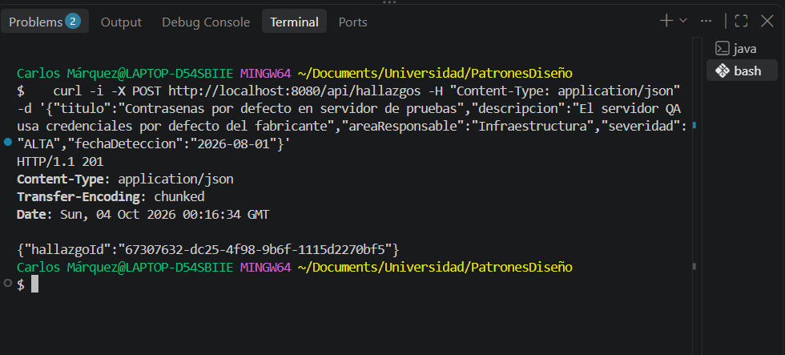
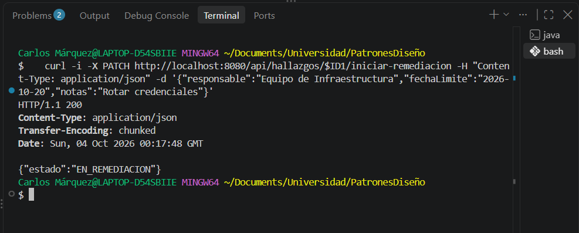
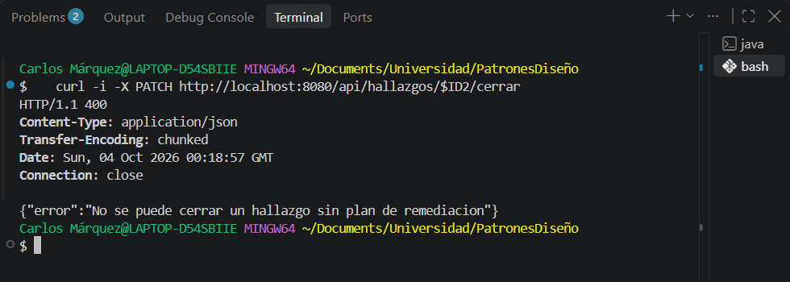
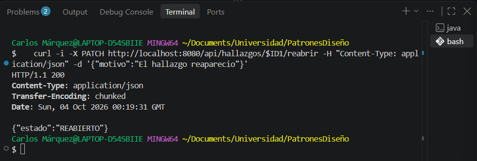
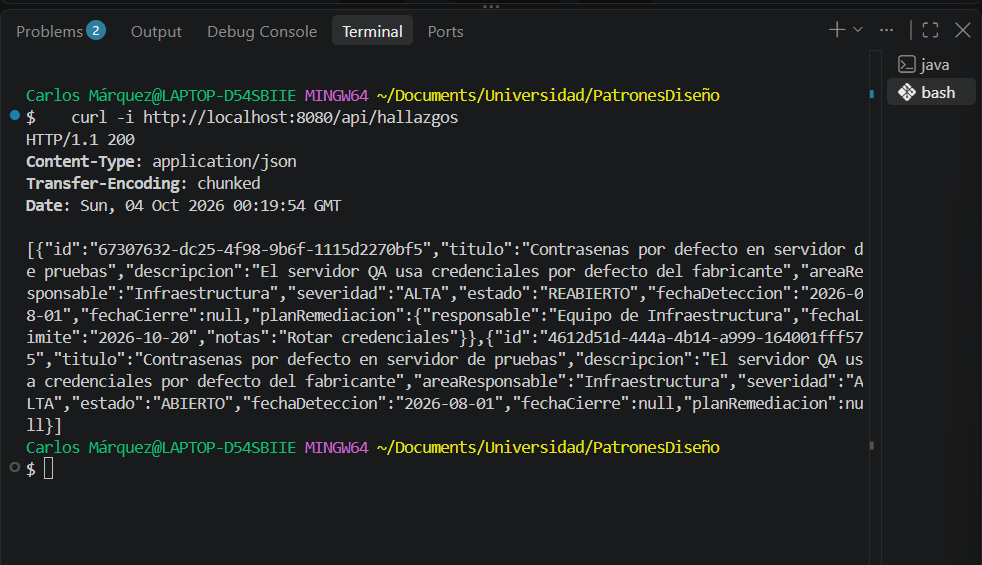
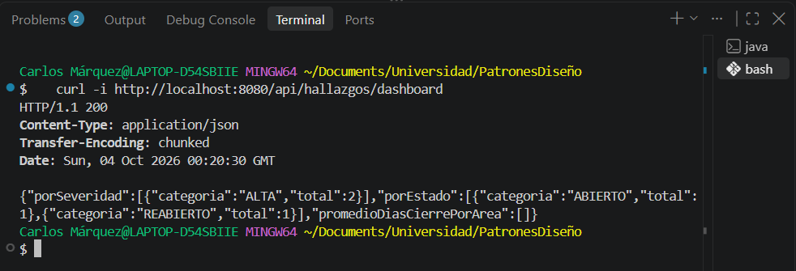
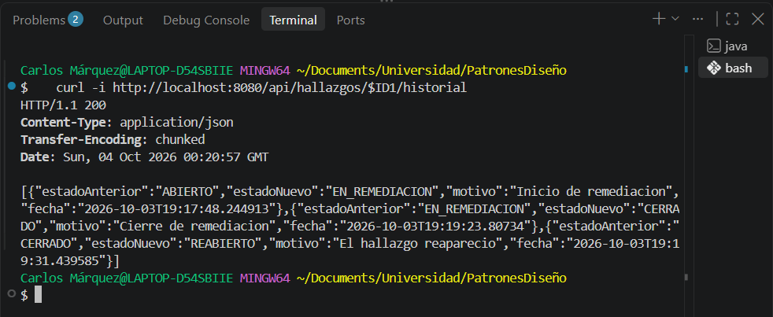

# Post-contenido — Unidad 8: Patrones Arquitectónicos II

## Descripción
Repositorio del post-contenido de la Unidad 8 de Patrones de Diseño
de Software — Sexto Semestre. Sistema de seguimiento de hallazgos
de auditoria interna implementado con Clean Architecture (Parte 1)
y extendido con dashboard agregado y bitacora de trazabilidad
(Parte 2), sobre el mismo proyecto Spring Boot.

## Parte 1 — Clean Architecture (Hallazgos de Auditoria)
El proyecto organiza los cuatro circulos concentricos: Entities
(domain/, con el Aggregate Root HallazgoAuditoria y su maquina de
estados EstadoHallazgo), Use Cases (usecase/, con los puertos y sus
implementaciones), Interface Adapters (adapter/, con
HallazgoController y HallazgoRepositoryAdapter) y Frameworks &
Drivers (Spring Boot + JPA). La dependencia del codigo siempre
apunta hacia adentro, hacia domain/.

```
src/main/java/com/example/auditoria/
├── domain/
│   ├── entity/
│   │   └── HallazgoAuditoria.java       ← Aggregate Root (Círculo Entities)
│   └── valueobject/
│       ├── HallazgoId.java
│       ├── Severidad.java
│       ├── EstadoHallazgo.java
│       ├── PlanRemediacion.java
│       └── TransicionInvalidaException.java
├── usecase/                             ← Círculo Use Cases
│   ├── RegistrarHallazgoUseCase.java, IniciarRemediacionUseCase.java,
│   │   CerrarHallazgoUseCase.java, ReabrirHallazgoUseCase.java, ConsultarHallazgoUseCase.java
│   ├── port/
│   │   └── HallazgoRepositoryPort.java  ← Puerto de salida
│   └── impl/                            ← Una clase por caso de uso
├── adapter/                             ← Círculo Interface Adapters
│   ├── in/web/
│   │   ├── HallazgoController.java
│   │   └── dto/
│   └── out/persistence/
│       ├── HallazgoJpaEntity.java
│       ├── HallazgoJpaRepository.java
│       └── HallazgoRepositoryAdapter.java
├── config/
│   └── AuditoriaConfiguration.java      ← Wiring explícito
└── AuditoriaHallazgosApplication.java
```

Los paquetes domain/ y usecase/ no importan Spring ni JPA. La prueba
HallazgoAuditoriaTest instancia el agregado y lo hace transicionar solo
con JUnit, sin @SpringBootTest.

## Parte 2 — Analisis costo-beneficio de CQRS/Event Sourcing
**Escala y carga.** Es un sistema académico: lo usarían unos pocos
auditores y el comité, que consulta el dashboard antes de su reunión
mensual. No hay usuarios concurrentes reales ni una diferencia de
escala entre lecturas y escrituras, las dos son bajas. No se justifica
infraestructura separada para leer y para escribir.

**Complejidad de las consultas.** El dashboard son dos conteos con
GROUP BY (por severidad y por estado) y un promedio de días agrupado
por área, todo sobre la misma tabla. Se resuelve con consultas JPQL y
projections de Spring Data en el mismo HallazgoJpaRepository. No hace
falta otra base de datos ni otro esquema.

**Consistencia.** El comité no necesita el dashboard en tiempo real.
Es aceptable que muestre el estado al momento de la consulta, como
cualquier reporte bajo demanda. Además, como lee del mismo esquema en
el que se escribe, siempre está actualizado y no aparece la
consistencia eventual que traería un modelo de lectura separado.

**Naturaleza de la trazabilidad exigida.** Cumplimiento necesita ver la
secuencia de cambios de estado de un hallazgo (de qué estado a qué
estado, el motivo y cuándo). No necesita reconstruir el estado completo
del hallazgo reproduciendo eventos. Para eso basta una bitácora
cronológica adicional que coexista con el estado actual, que ya se
guarda en la tabla de hallazgos.

**Señales de sobre-ingeniería.** No hay un experto de negocio
disponible para modelar los eventos, el equipo es una sola persona sin
experiencia previa en Event Sourcing, y mantener dos modelos separados
(proyecciones, replay, versionado de eventos) cuesta mucho más que el
problema, que son tres consultas y una tabla de historial.

**Conclusión.** CQRS y Event Sourcing completos no se justifican
todavía para este proyecto. Se implementó la extensión liviana: tres
consultas agregadas en el mismo HallazgoRepositoryPort y una bitácora
simple (HistorialCambioEstado) que no reemplaza al modelo de estado
actual.

## Decisiones de diseño
1. Severidad como enum simple vs. EstadoHallazgo como enum con
   maquina de estados — EstadoHallazgo tiene una regla de negocio real:
   qué transiciones son válidas (ABIERTO → EN_REMEDIACION → CERRADO →
   REABIERTO → EN_REMEDIACION). Por eso tiene el método
   puedeTransicionarA y la regla queda junto al valor. Severidad es solo
   una clasificación de cuatro valores sin reglas propias: ninguna
   severidad es "más válida" que otra y no hay transiciones entre
   ellas, así que darle métodos sería agregar comportamiento que nadie
   usa. Se habría preferido lo contrario si existiera una regla propia
   de la severidad, por ejemplo un plazo máximo de remediación según el
   nivel.
2. PlanRemediacion como Value Object embebido vs. agregado separado
   — Un hallazgo no puede pasar a EN_REMEDIACION sin un plan válido ni
   cerrarse sin tener uno. Esa invariante se debe cumplir siempre en la
   misma transacción. Según el criterio de límite de consistencia
   transaccional de los Agregados (Sección 3.3 de la guía), lo que debe
   ser consistente de inmediato va dentro del mismo agregado. Por eso
   PlanRemediacion es un record inmutable dentro de HallazgoAuditoria y
   se guarda en la misma tabla. Como agregado separado, con su propio
   repositorio, podría existir un momento en que el hallazgo esté
   EN_REMEDIACION y el plan todavía no exista.
3. CQRS/Event Sourcing completos vs. extension liviana del
   repositorio existente — Se eligió la extensión liviana. Aplicando los
   criterios de la Sección 7 de la guía: no hay diferencia de escala
   entre lecturas y escrituras, las consultas del dashboard se resuelven
   con GROUP BY sobre el mismo esquema y el comité no necesita tiempo
   real. Por eso se extendió el mismo HallazgoRepositoryPort con tres
   métodos y se implementaron con projections en el mismo
   HallazgoJpaRepository, sin crear un repositorio ni un modelo de
   lectura separados.
4. Bitacora simple (HistorialCambioEstado) vs. Event Store completo
   — Un Event Store obligaría a que HallazgoAuditoria dejara de guardar
   su estado y se reconstruyera por replay en cada lectura, un cambio
   grande sobre un agregado que ya funciona. Cumplimiento solo necesita
   ver la secuencia de cambios, no que la bitácora sea la fuente de
   verdad. Las señales de sobre-ingeniería de la Sección 7.2 están
   presentes: no hay experto de negocio para modelar eventos, el equipo
   es una persona sin experiencia en Event Sourcing y el costo de dos
   modelos no es proporcional al problema. La bitácora es una tabla
   adicional (historial_cambios_estado) en la que solo se insertan
   registros: el puerto HistorialAuditoriaPort solo tiene registrar y
   listarPorHallazgo, no hay ningún método para actualizar ni borrar.
   Cada transición guarda el hallazgo y su registro en la misma
   transacción (AuditoriaConfiguration ejecuta esos casos de uso con
   TransactionTemplate). HallazgoJpaEntity sigue siendo la única fuente
   del estado actual.

## Cómo ejecutar
```
$ mvn spring-boot:run
```

## Capturas de pantalla
Registrar un hallazgo (201, con el hallazgoId en formato UUID):



Iniciar remediación (200):



Cerrar un hallazgo ABIERTO sin plan (400):



Reabrir un hallazgo CERRADO (200):



Listar hallazgos:



Dashboard:



Historial de un hallazgo:



## Herramientas utilizadas
- Java 17, Spring Boot 3.x, Spring Data JPA, H2
- Apache Maven, Postman/curl, Git, GitHub

## Conclusiones
Con Clean Architecture aprendí a separar las reglas del negocio de los
detalles técnicos: la máquina de estados quedó en el dominio y se puede
probar sin Spring, y la base de datos solo se conoce desde los
adaptadores. En la Parte 2 entendí que un requisito que suena a CQRS o
a Event Sourcing no obliga a usarlos: al revisar la escala, las
consultas y lo que realmente pide Cumplimiento, bastó con extender el
mismo repositorio y agregar una bitácora. Reconsideraría la decisión si
el sistema creciera, por ejemplo si el dashboard tuviera que consultar
millones de hallazgos o con una tecnología distinta, si Cumplimiento
exigiera reconstruir el estado completo de un hallazgo en una fecha
pasada, o si otros sistemas tuvieran que reaccionar a cada cambio de
estado.
